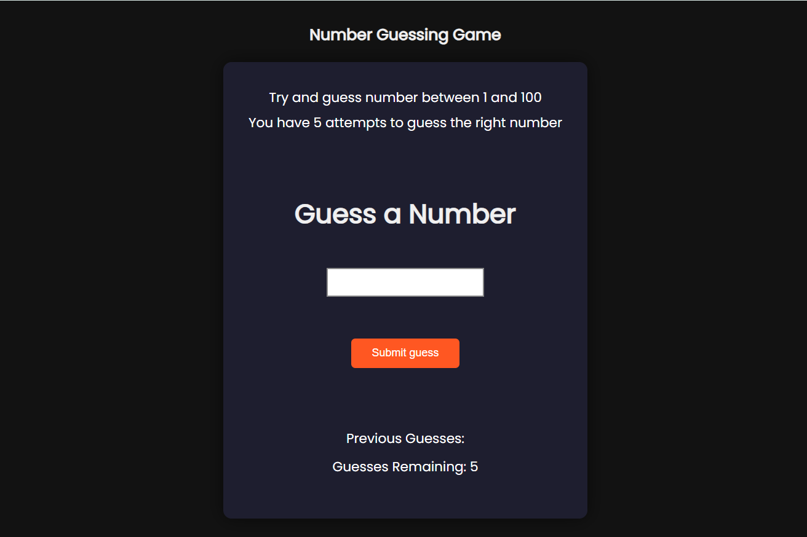

# 🎯 Number Guessing Game

Welcome to the **Number Guessing Game** — a fun, interactive web-based game where players try to guess a randomly generated number between 1 and 100 within 5 attempts.

## 🚀 Features

- Random number generation between 1 and 100
- Limited to 5 guessing attempts
- Real-time feedback on guess (Too Low / Too High / Correct)
- Displays previous guesses and remaining attempts
- Option to restart the game after ending
- Clean and responsive UI using HTML, CSS, and JavaScript

## 📸 Preview


) <!-- Optional: Add a screenshot in your repo -->

## 🛠️ Built With

- HTML5
- CSS3
- JavaScript

## 📂 How to Run

1. Clone this repository:
   ```bash
   git clone https://github.com/your-username/number-guessing-game.git

## 🙌 Acknowledgements
- This project is part of my ongoing journey to improve my frontend and JavaScript skills. Suggestions and improvements are always welcome!

## 📬 Contact Me

- **👤 Name**: Aditya Roy  
- **🔗 LinkedIn**: [linkedin.com/in/aditya-roy-5a39b429a](https://www.linkedin.com/in/aditya-roy-5a39b429a)  
- **🐱 GitHub**: [github.com/Adityaroy000](https://github.com/Adityaroy000)
